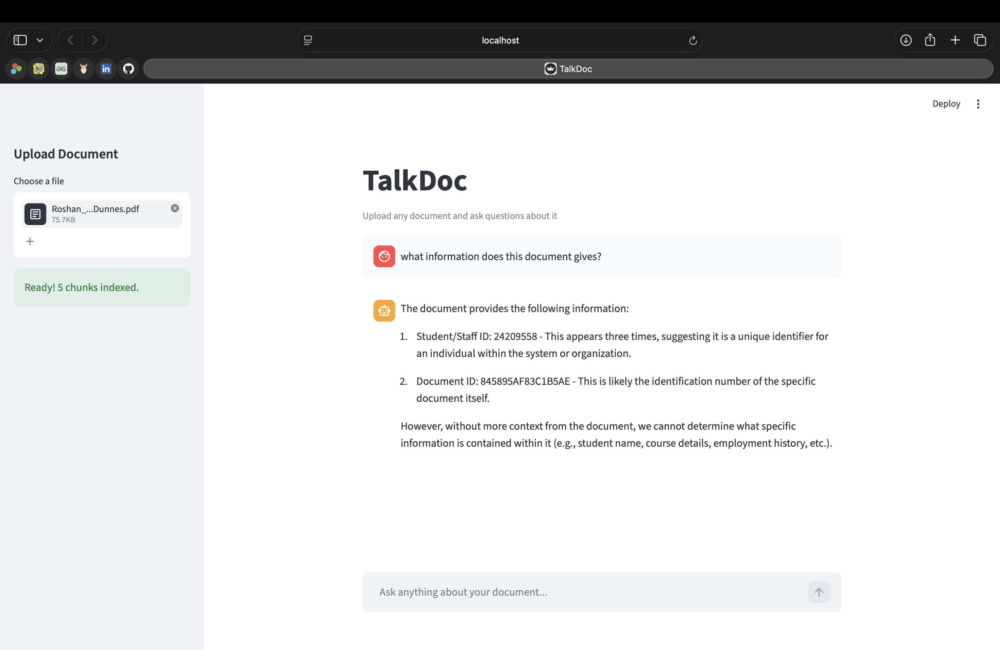

# TalkDoc 

A RAG-powered document Q&A system. Upload any PDF or text file and ask questions about it in plain English.

Built with LangChain, ChromaDB, OpenAI, and Streamlit.

## What it does

- Upload one or multiple PDFs or text files
- Automatically chunks, embeds, and indexes your documents
- Ask questions in plain English and get accurate, grounded answers
- See the exact source chunk the answer came from

## Tech stack

- LangChain — document loading, chunking, retrieval chain
- ChromaDB — local vector database
- Ollama + Mistral 7B — local LLM, zero API costs
- Streamlit — web interface

## Project structure

talkdoc/
│
├── src/
│   ├── loader.py       # document loading (PDF, TXT, DOCX)
│   ├── chunker.py      # text splitting
│   ├── embedder.py     # embedding + vector store
│   └── retriever.py    # retrieval chain
│
├── app.py              # Streamlit UI
├── requirements.txt    # dependencies
└── .gitignore

## Setup

1. Install Ollama from https://ollama.com
2. Run `ollama pull mistral`
3. Clone this repo
4. Run `pip install -r requirements.txt`
5. Run `streamlit run app.py`

## Demo

## Status

Complete
